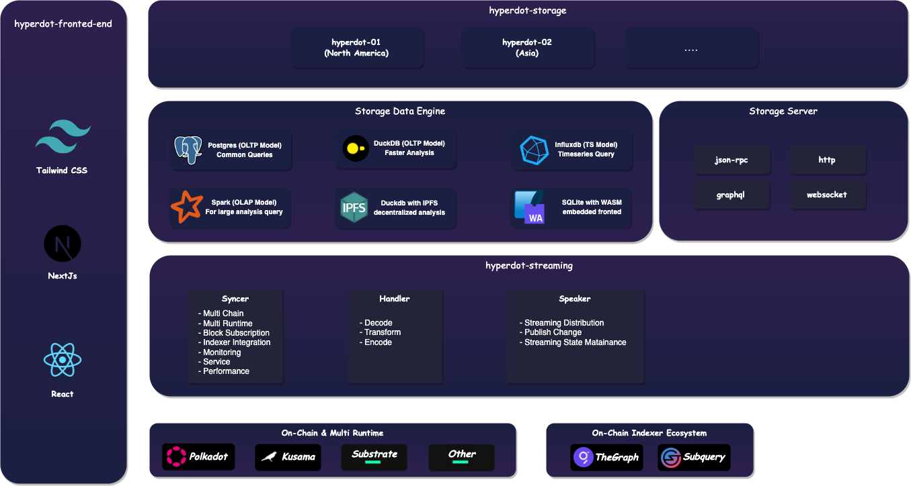
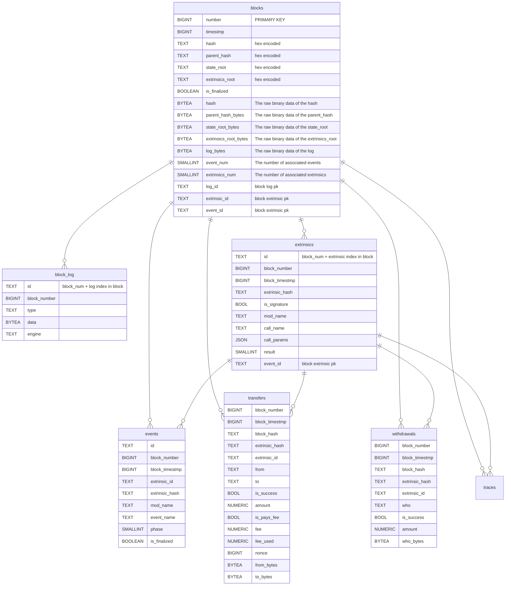
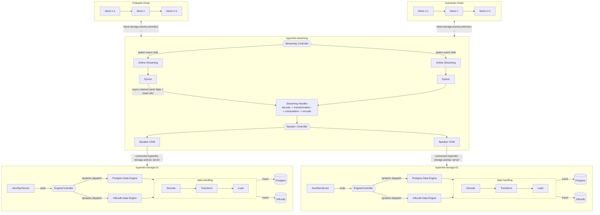

# Hyperdot

## Overview
The Hyperdot project consists of two main system: hyperdot-node and hyperdot-frontend-end.

hyperdot-Node is written in [rust](https://www.rust-lang.org/) and provides functionalities such as chain data subscription, indexer, synchronization, and storage data to different engines. 

It serves as the backend for hyperdot-frontend-end, offering data querying and backend services. Specifically, the streaming module of hyperdot-node utilizes [subxt](https://github.com/paritytech/subxt) to subscribe to dara from Polkadot, Kusama, and other parallel chains built on Substrate Runtime. The data is then decoded and handled processed using [substrate](https://github.com/paritytech/substrate) some mods and [parity-scale-codec](https://github.com/paritytech/parity-scale-codec) and subsequently distributed to storage nodes.

hyperdot-frontend-end is built using [tailwind css](https://tailwindcss.com/) and [next.js](https://nextjs.org/), creating a modern web dashboard. While it works similar to Dune Analytics, it has its own unique features. Hyperdot-Frontend connects to Hyperdot-Node to provide users with user-friendly chain data analysis capabilities. Moreover, it aims to establish a data analysis community where data engineers and data scientists can create and share insights based on the data provided by Hyperdot.

## System Architecture

We have observed certain limitations in the existing designs of data analytics systems. Most of the designs involve subscribing to or querying on-chain crypto data, or integrating  like Subquery or Thegraph to indexing data with specific schemes, which are then stored in local postgre databases. However, this design suffers from the following issues:

1. With the support for multiple chains and increasing data volumes, a single data service will face scalability challenges.
2. Existing systems often rely on a single data analytics engine. For instance, during our tests on Dune, executing `SELECT * FROM ethereum.blocks` took a long time to load. The key issue is the lack of a dedicated OLAP engine to accelerate queries.
3. Data analytics services need to cater to a global user base, but current systems struggle to provide localized services.

Hyperdot is a system designed with a separation of on-chain block data computation and data storage to address the core challenges of scalability and system availability in multi-chain data.  

The following is the system architecture figure of hyperdot:

The system architecture is divided into three main components: `hyperdot-streaming`, `hyperdot-storage` and `hyperdot-fronted-end`. The `hyperdot-streaming` is responsible for data synchronization, decoding, and computation of on-chain block data, while the  `hyperdot-storage`   is designed to store on-chain data and build powerful data enegines.

The `hyperdot-streaming`  is responsible for on-chain block  subscription, computation and distribution, consisting of the following components:

1. **Streaming Syncer**:
   - Supports multiple chains, including Polkadot, Substrate, and other custom chains.
   - Provides support for multiple runtimes in Substrate to enable greater flexibility in adapting to chains developed on the Substrate framework. 
   - Subscribes to on-chain and indexer data.
   - Designed to be scalable and parallel, with separate asynchronous tasks for different chains.
   - Integrating a new chain only requires adding the corresponding configuration through the system interface, and the Syncer will automatically start data synchronization for that chain.

2. **Streaming Handler**
   - Used to decode on-chain data and extract additional information.
   - The decoded data undergoes necessary computation and transformation.
   - This may involve data cleaning, transformation, and computation to generate more useful data.

3. **Streaming Speaker**
   - Connects to the Hyperdot-Storage layer to distribute processed data to globally distributed storage nodes.
   - Encoded data streams are sent to storage nodes using the JSON-RPC protocol.
   - The Speaker's key functionality lies in ensuring reliable data distribution and storage to meet scalability and availability requirements of the system.

The hyperdot-storage layer is designed for multiple storage nodes and multiple data engines to address the aforementioned challenges. Each storage node is fully peer, accepts data from the hyperdot-streaming layer, and can store data from one or more chains. Data is configured and written to different data engines, and data engines process and write data according to the data model established in advance. For example, postgres has a row-oriented table model, whereas duckdb or clickhous has a column-oriented table model.

The hyperdot-storage consisting of the following components:

1. **Data Engines.** Supports multiple data engine to flexibly adapt to different query scenarios. For instance, postgres, provides a very stable storage and sql query scenario and is the choice for most cases. But when your data grows to tens of millions of rows, you can switch to duckdb or clickhouse to reduce user-perceived latency.

2. **Storage Server**:
   - Provides multiple interface services, including JSON-RPC, HTTP, GraphQL, and Websocket.
   - The JSON-RPC interface receives data from the Streaming layer.
   - HTTP, GraphQL, and Websocket interfaces serve as the backend services for Hyperdot-Frontend.
   - These interfaces support data querying, data analysis, dashboard creation, and fulfill the needs of the data analysis community.

hyperdot-fronted-end provides a user-friendly front-end interface for data analysis, exploration, and collaborative data analysis creation. It is built using modern front-end technologies. The interaction between hyperdot-fronted-end and hyperdot primarily utilizes HTTP, while GraphQL is used for handling complex data queries. WebSockets are employed for subscription-based data updates.

## Data Model

Since we support multiple data engines, the way data models are defined varies in each data engine. As a good starting point, we have defined raw data models for Substrate in the PostgreSQL data engine.

For other data engines, the core concepts remain the same, but the expression may differ based on the data engine. For example, in DuckDB and ClickHouse, it might be necessary to modify the data types to make them compatible. In InfluxDB, it might be necessary to switch to a time-series data model to incorporate temporal concepts.

> Note: We have omitted the detailed definition of the trace data model as it is nearly identical to extrinsics.

## Data Flow

The high-level data flow of hyperdot handling crypto on-chain data from a substrate chain is as follows:

1. hyperdot-streaming creates a `StreamingSyncer` for each chain to subscribe to the crypto on-chain data. These streaming and syncer are managed through the `StreamingController`.
2. When streaming detects the arrival of data, it sends it through a channel to the `StreamingHandler `for processing. The `StreamingHandler` performs necessary `decoding, transformation, computation, and encoding` of the on-chain data based on the configured chain information and runtime `codegen`.
3. The encoded data is handed over by the `StreamingHandler` to the SpeakerController and transmitted over the network to the `JsonRpcServer` of hyperdot-storage.
4. Upon receiving the data, `hyperdot-storage` invokes the `EngineController` to perform the data writing.
5. The `EngineController` contains pointers to multiple data engines and dynamically dispatches the write operation to the specific data engine at runtime.
6. Each data engine may undergo an optional set of data-handling operations, such as decoding, transforming, and loading, to adapt the data for the specific data engine.
7. Finally, the data engine completes the data writing process.

## Quick start

## Contribution Guidelines