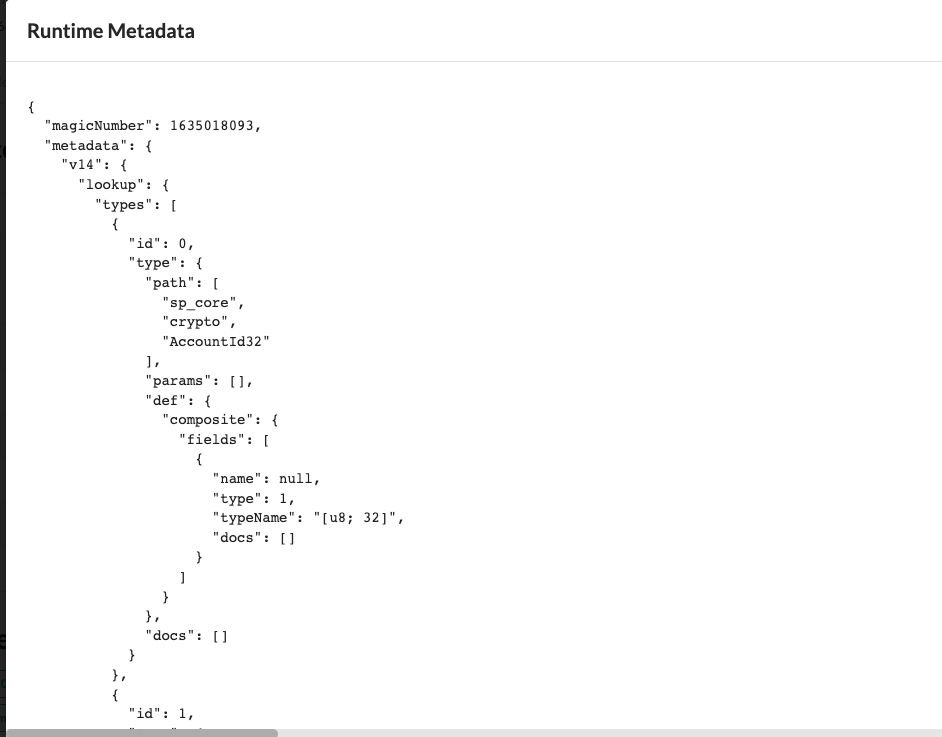
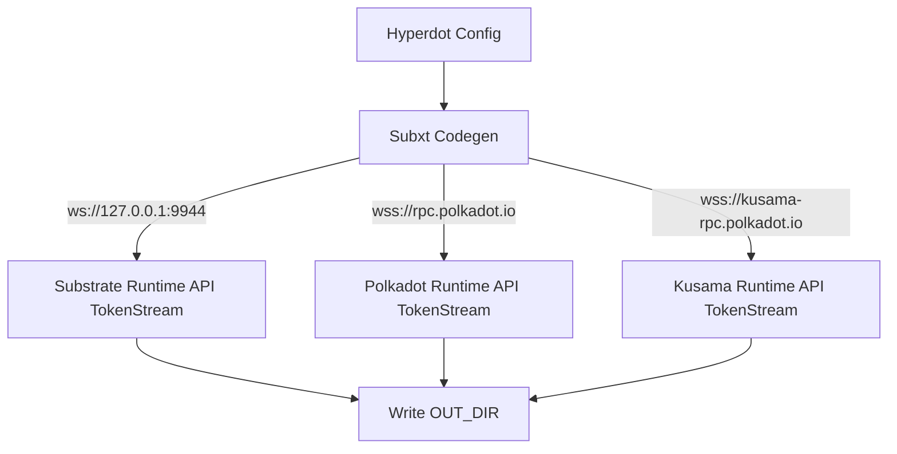

# Substrate runtime codegen

## Overview

substrate provides runtime metadata to control the runtime behavior of substrate. If you run substarte locally and open it with front-end, you can see the runtime metadata information, as shown in the following figure:

Alternatively, you can get runtime metadata information via rpc, For example [state_getMetadata](https://polkadot.js.org/docs/substrate/rpc#getmetadataat-blockhash-metadata).

Substrate using [scale](https://docs.substrate.io/reference/scale-codec/) coding the runtime data, so we need to use the scale decoding.

## How it works.

In rust, we can decode the metadata we get using [parity-scale-codec](https://docs.rs/parity-scale-codec/3.6.1/parity_scale_codec/), And generate data structures in rust based on the information in metadata.

Fortunately, [subxt-codegen](https://docs.rs/subxt-codegen/0.29.0/subxt_codegen/) does it all, so integrating subxt-codegen, We can design a good runtime codegen

